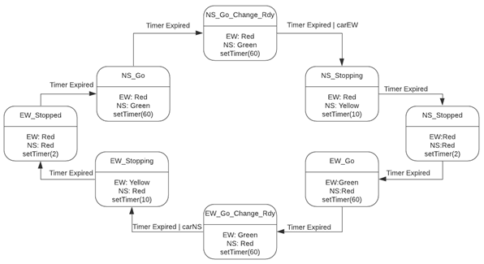
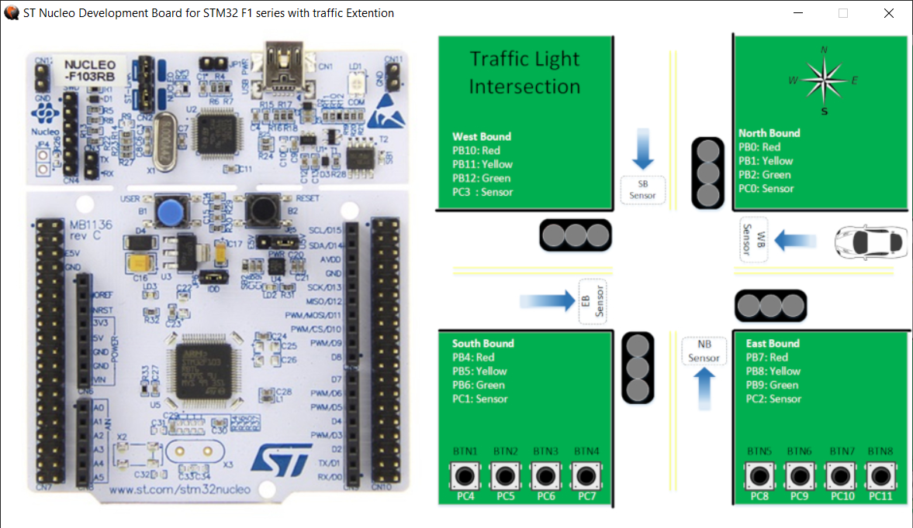
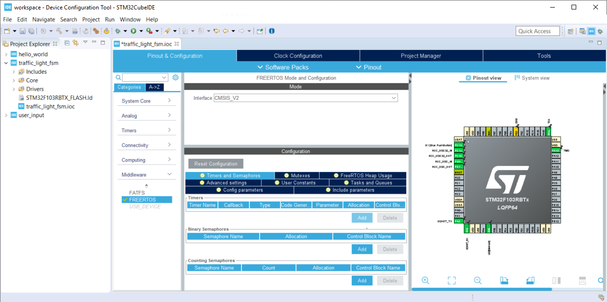
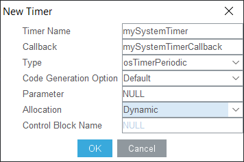
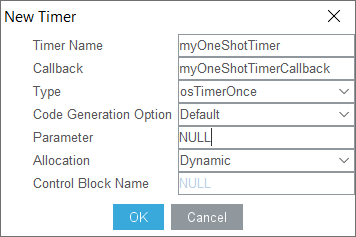
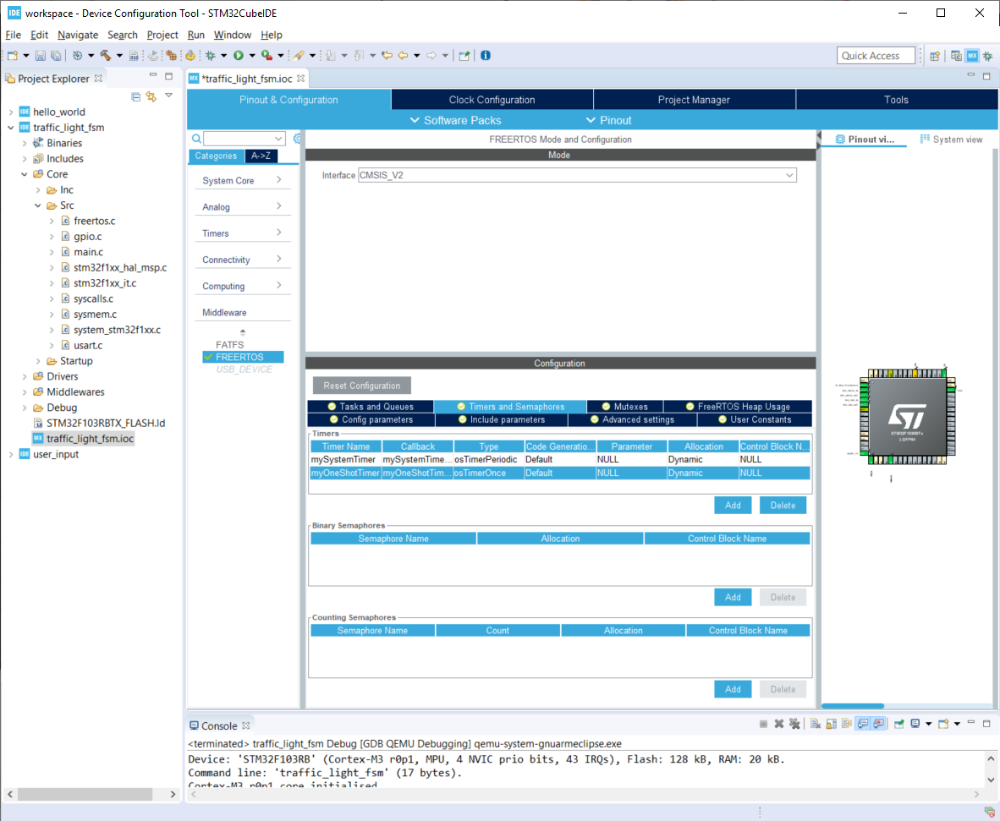
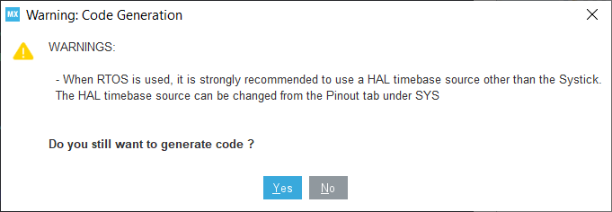
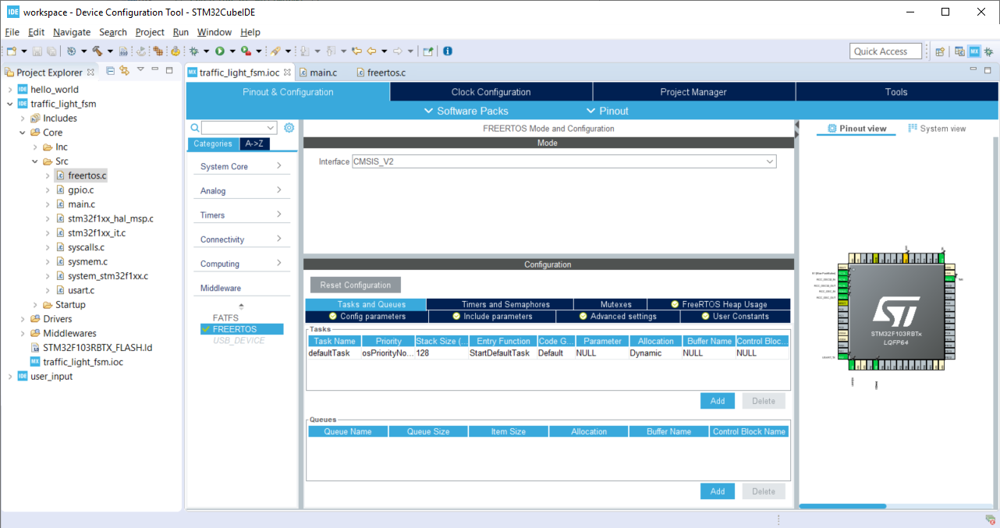

**EN.525.615 Laboratory 04  
Dave Jansing  
Spring 2022**

- [Experiment 1:  Traffic Light Intersection System](#experiment-1--traffic-light-intersection-system)
  - [Experimental Setup](#experimental-setup)
    - [NUCLEO-F103RB-TRAFFIC Pin Definitions](#nucleo-f103rb-traffic-pin-definitions)
    - [Enable FreeRTOS Middleware](#enable-freertos-middleware)
    - [QEMU FreeRTOS Port Bug fix](#qemu-freertos-port-bug-fix)
    - [Add More GPIO](#add-more-gpio)
    - [A New Main Loop](#a-new-main-loop)
    - [Starting the software timer](#starting-the-software-timer)
  - [Build The System](#build-the-system)
  - [References](#references)

NOTE:  You will be responsible for writing a lab report for this laboratory.  You will modify the `lab_report.md` file in the `report` directory in your repository, putting any images, etc into the `media` directory.  Markdown cheat sheets can be found in the `supporting` directory.

# Experiment 1:  Traffic Light Intersection System

In this experiment, you will create a system that implements the following
state machine.



You will use the QEMU Board Model `NUCLEO-F103RB-TRAFFIC`.

Be sure to enter `NUCLEO-F103RB-TRAFFIC` in the debug configuration menu

This model connects GPIO ports to virtual LEDs and Sensors (Buttons)
that are overlaid on a Traffic Light Intersection image.



## Experimental Setup

NOTE:  You may want to refer back to Lab 3 for how to create an STM32 Project.

-   In the same workspace create a new project called
    `traffic_light_fsm`

-   The target board is the NUCLEO-F103RB

### NUCLEO-F103RB-TRAFFIC Pin Definitions

The follow table shows how the pins are connected to the sensors and
LEDs in the intersection.

<table>
<colgroup>
<col style="width: 50%" />
<col style="width: 50%" />
</colgroup>
<tbody>
<tr class="odd">
<td style="text-align: left;"><p>Device</p></td>
<td style="text-align: left;"><p>Port / Pin</p></td>
</tr>
<tr class="even">
<td style="text-align: left;"><p>led:NB-RED</p></td>
<td style="text-align: left;"><p>PB0</p></td>
</tr>
<tr class="odd">
<td style="text-align: left;"><p>led:NB-YELLOW</p></td>
<td style="text-align: left;"><p>PB1</p></td>
</tr>
<tr class="even">
<td style="text-align: left;"><p>led:NB-GREEN</p></td>
<td style="text-align: left;"><p>PB2</p></td>
</tr>
<tr class="odd">
<td style="text-align: left;"><p>led:SB-RED</p></td>
<td style="text-align: left;"><p>PB4</p></td>
</tr>
<tr class="even">
<td style="text-align: left;"><p>led:SB-YELLOW</p></td>
<td style="text-align: left;"><p>PB5</p></td>
</tr>
<tr class="odd">
<td style="text-align: left;"><p>led:SB-GREEN</p></td>
<td style="text-align: left;"><p>PB6</p></td>
</tr>
<tr class="even">
<td style="text-align: left;"><p>led:EB-RED</p></td>
<td style="text-align: left;"><p>PB7</p></td>
</tr>
<tr class="odd">
<td style="text-align: left;"><p>led:EB-YELLOW</p></td>
<td style="text-align: left;"><p>PB8</p></td>
</tr>
<tr class="even">
<td style="text-align: left;"><p>led:EB-GREEN</p></td>
<td style="text-align: left;"><p>PB9</p></td>
</tr>
<tr class="odd">
<td style="text-align: left;"><p>led:WB-RED</p></td>
<td style="text-align: left;"><p>PB10</p></td>
</tr>
<tr class="even">
<td style="text-align: left;"><p>led:WB-YELLOW</p></td>
<td style="text-align: left;"><p>PB11</p></td>
</tr>
<tr class="odd">
<td style="text-align: left;"><p>led:WB-GREEN</p></td>
<td style="text-align: left;"><p>PB12</p></td>
</tr>
<tr class="even">
<td style="text-align: left;"><p>button:NB-Sensor</p></td>
<td style="text-align: left;"><p>PC0</p></td>
</tr>
<tr class="odd">
<td style="text-align: left;"><p>button:SB-Sensor</p></td>
<td style="text-align: left;"><p>PC1</p></td>
</tr>
<tr class="even">
<td style="text-align: left;"><p>button:EB-Sensor</p></td>
<td style="text-align: left;"><p>PC2</p></td>
</tr>
<tr class="odd">
<td style="text-align: left;"><p>button:WB-Sensor</p></td>
<td style="text-align: left;"><p>PC3</p></td>
</tr>
<tr class="even">
<td style="text-align: left;"><p>button:BTN1</p></td>
<td style="text-align: left;"><p>PC4</p></td>
</tr>
<tr class="odd">
<td style="text-align: left;"><p>button:BTN2</p></td>
<td style="text-align: left;"><p>PC5</p></td>
</tr>
<tr class="even">
<td style="text-align: left;"><p>button:BTN3</p></td>
<td style="text-align: left;"><p>PC6</p></td>
</tr>
<tr class="odd">
<td style="text-align: left;"><p>button:BTN4</p></td>
<td style="text-align: left;"><p>PC7</p></td>
</tr>
<tr class="even">
<td style="text-align: left;"><p>button:BTN5</p></td>
<td style="text-align: left;"><p>PC8</p></td>
</tr>
<tr class="odd">
<td style="text-align: left;"><p>button:BTN6</p></td>
<td style="text-align: left;"><p>PC9</p></td>
</tr>
<tr class="even">
<td style="text-align: left;"><p>button:BTN7</p></td>
<td style="text-align: left;"><p>PC10</p></td>
</tr>
<tr class="odd">
<td style="text-align: left;"><p>button:BTN8</p></td>
<td style="text-align: left;"><p>PC11</p></td>
</tr>
</tbody>
</table>

### Enable FreeRTOS Middleware

The QEMU model of our board does not implements timers so we will use
FreeRTOS and their software timers for this.

-   In the Device Configuration Perspective we need to enable FreeRTOS
    and some features

    -   Click `Middleware`

    -   Click `FreeRTOS`

    -   Change `Interface` from `Disabled` to `CMSIS_V2`

    -   Click on the `Timers and Semaphores` tab



-   Click `Add` in the `Timers Area` and fill in the boxes as shown below.

-   Press `Ok`



-   Add a second timer, but this time make it a `osTimerOnce`

-   Press `Ok`



You should now have a Device Configuration similar to the image below.



-   Press `Ctrl-S` to save this configuration and generate code.

You will be prompted with this warning



Due to the fact that the QEMU doesn’t model any timers beyond Systick,
we are forced to proceed. This is a virtual system, so we will be ok.

-   Click `Yes`

### QEMU FreeRTOS Port Bug fix

There is a bug in the QEMU model that is related to how FreeRTOS
verifies it understands the hardware it is running on.

Navigate to the `xPortStartScheduler` function in the `port.c` file (it should be in `<workspace>/traffic_light_fsm/Middlewares/Third_Party/FreeRTOS/Source/portable/GCC/ARM_CM3`).

You can enter the function `xPortStartScheduler` (inside `port.c`) in one of your projects source files
and `Ctrl-Left Click` on the function to jump to it!

Or, navigate to Line 290 and nearby you should see a line with
`ulMaxPRIGROUPValue = portMAX_PRIGROUP_BITS;`

Disable the checks immediately after that line by adding the
`#if 0 / #endif` blocks as seen below. Then save the file.

```
/* Calculate the maximum acceptable priority group value for the number
of bits read back. */
ulMaxPRIGROUPValue = portMAX_PRIGROUP_BITS;

#if 0
  while( ( ucMaxPriorityValue & portTOP_BIT_OF_BYTE ) == portTOP_BIT_OF_BYTE )
  {
    ulMaxPRIGROUPValue--;
    ucMaxPriorityValue <<= ( uint8_t ) 0x01;
  }
  #ifdef __NVIC_PRIO_BITS
  {
    /* Check the CMSIS configuration that defines the number of
    priority bits matches the number of priority bits actually queried
    from the hardware. */
    configASSERT( ( portMAX_PRIGROUP_BITS - ulMaxPRIGROUPValue ) == __NVIC_PRIO_BITS );
  }
  #endif
  #ifdef configPRIO_BITS
  {
    /* Check the FreeRTOS configuration that defines the number of
    priority bits matches the number of priority bits actually queried
    from the hardware. */
    configASSERT( ( portMAX_PRIGROUP_BITS - ulMaxPRIGROUPValue ) == configPRIO_BITS );
  }
  #endif
#endif
```

*This procedure needs to be done each time the Device Configuration Tool is run. Alternatively you can edit/replace the `port.c` file in the STM32CubeIDE installation directory to work around this.*

### Add More GPIO

We will now programmatically add some more GPIO Pins.  You might want to refer to the table above for the Pin Definitions for this project.
We will add the North Bound LEDs.
Since the `GPIO_PIN_X` is a bit mask and this set of LEDs is on the same port, we can initialize them all at once.

* Open the `main.h`
* Locate the `/* USER CODE BEGIN Private defines */` section
* Update it with the following contents

```
/* USER CODE BEGIN Private defines */

#define LD_NB_RED_GPIO_Port    (GPIOB)
#define LD_NB_YELLOW_GPIO_Port (GPIOB)
#define LD_NB_GREEN_GPIO_Port  (GPIOB)
#define LD_NB_GPIO_Port        (GPIOB) //these are all on the same port - lets make a common def

#define LD_NB_RED_Pin          (GPIO_PIN_0)
#define LD_NB_YELLOW_Pin       (GPIO_PIN_1)
#define LD_NB_GREEN_Pin        (GPIO_PIN_2)

/* USER CODE END Private defines */
```

* Open the `gpio.h`
* Locate the `/* USER CODE BEGIN Includes */` and `/* USER CODE BEGIN Prototypes */` sections
* Update it with the following contents

```
/* USER CODE BEGIN Includes */
#include "main.h"
/* USER CODE END Includes */
```

```
/* USER CODE BEGIN Prototypes */
void CUSTOM_GPIO_Init(void);
/* USER CODE END Prototypes */
```


* Open the `gpio.c`
* Locate the `/* USER CODE BEGIN 1 */` section
* Update it with the following contents


```
/* USER CODE BEGIN 1 */
void CUSTOM_GPIO_Init()
{
    //Init NB LED's
    GPIO_InitTypeDef GPIO_InitStruct = {0};

    /* GPIO Ports Clock Enable */
    __HAL_RCC_GPIOB_CLK_ENABLE();

    /*Configure GPIO pin Output Level */
    HAL_GPIO_WritePin(LD_NB_GPIO_Port, LD_NB_RED_Pin|LD_NB_YELLOW_Pin|LD_NB_GREEN_Pin, GPIO_PIN_RESET);

    /*Configure GPIO pin : PtPin */
    GPIO_InitStruct.Pin = LD_NB_RED_Pin|LD_NB_YELLOW_Pin|LD_NB_GREEN_Pin;
    GPIO_InitStruct.Mode = GPIO_MODE_OUTPUT_PP;
    GPIO_InitStruct.Pull = GPIO_NOPULL;
    GPIO_InitStruct.Speed = GPIO_SPEED_FREQ_LOW;
    HAL_GPIO_Init(LD_NB_GPIO_Port, &GPIO_InitStruct);

}
/* USER CODE END 1 */
```

* Open the `main.c`
* Locate the `/* USER CODE BEGIN 2 */` section
* Update it with the following contents

```
    /* Initialize all configured peripherals */
    MX_GPIO_Init();
    MX_USART2_UART_Init();
    /* USER CODE BEGIN 2 */
    CUSTOM_GPIO_Init();
    /* USER CODE END 2 */
```

### A New Main Loop

Our main function looks a bit different now. Notice the comment that we
should never make it to the main infinite loop. That is because
`osKernelStart` should never return.

```
/* Init scheduler */
osKernelInitialize();  /* Call init function for freertos objects (in freertos.c) */
MX_FREERTOS_Init();
/* Start scheduler */
osKernelStart();

/* We should never get here as control is now taken by the scheduler */
/* Infinite loop */
/* USER CODE BEGIN WHILE */
while (1)
{
  /* USER CODE END WHILE */

  /* USER CODE BEGIN 3 */
}
/* USER CODE END 3 */
```

Open up `freertos.c` and you will see the `StartDefaultTask` functions.

```
/**
  * @brief  Function implementing the defaultTask thread.
  * @param  argument: Not used
  * @retval None
  */
/* USER CODE END Header_StartDefaultTask */
void StartDefaultTask(void *argument)
{
  /* USER CODE BEGIN StartDefaultTask */
  /* Infinite loop */
  for(;;)
  {
    osDelay(1);
  }
  /* USER CODE END StartDefaultTask */
}

```

There is nothing specific about the name of this function and FreeRTOS.
If you look at the `Tasks and Queues` tab in the FreeRTOS area of the
Device Configuration Tool you will see the tool defaulted to one initial
task. You can change the parameters and name of this task. You can also
add more tasks, similar to how we added multiple timers.



### Starting the software timer

Open up `freertos.c` and you will see the `mySystemTimerCallback` the software timer callback we defined earlier.

Every time our  `mySystemTimer` software timer expires, `mySystemTimerCallback` will get called.

Likewise, every time out `myOneShotTimer` software timer expires, `myOneShotTimerCallback` will get called.

```
/* mySystemTimerCallback function */
void mySystemTimerCallback(void *argument)
{
  /* USER CODE BEGIN mySystemTimerCallback */

  /* USER CODE END mySystemTimerCallback */
}
```

Let us do a simple update to toggle a few LEDs every time the `mySystemTimerCallback` function is called.

```
/* mySystemTimerCallback function */
void mySystemTimerCallback(void *argument)
{
  /* USER CODE BEGIN mySystemTimerCallback */
  HAL_GPIO_TogglePin(LD2_GPIO_Port,  LD2_Pin);
  HAL_GPIO_TogglePin(LD_NB_GPIO_Port,  LD_NB_RED_Pin | LD_NB_YELLOW_Pin );

  /* USER CODE END mySystemTimerCallback */
}
```

If you were to set a breakpoint in this function and run the code, we would never see a breakpoint trigger.
The reason is that we never actually started the timer!

Let us start the timers by updating the `StartDefaultTask` function.

```
/**
  * @brief  Function implementing the defaultTask thread.
  * @param  argument: Not used
  * @retval None
  */
/* USER CODE END Header_StartDefaultTask */
void StartDefaultTask(void *argument)
{
  /* USER CODE BEGIN StartDefaultTask */

  osTimerStart(mySystemTimerHandle, 1000);   //TICK_RATE_HZ is 1000, so 1000 ticks is a second
  osTimerStart(myOneShotTimerHandle, 10000); //TICK_RATE_HZ is 1000, so 10000 ticks is 10 seconds

  /* Infinite loop */
  for(;;)
  {
    osDelay(1);
  }
  /* USER CODE END StartDefaultTask */
}
```


Since we define the `mySystemTimer` to as `osTimerPeriodic` it will automatically reload until we tell the OS to stop it.

Let update our `myOneShotTimerCallback` to stop the periodic timer, turn off the toggling LEDs and turn on another LED.

```
/* myOneShotTimerCallback function */
void myOneShotTimerCallback(void *argument)
{
  /* USER CODE BEGIN myOneShotTimerCallback */
  osTimerStop(mySystemTimerHandle);
  HAL_GPIO_WritePin(LD_NB_GPIO_Port,  LD_NB_RED_Pin | LD_NB_YELLOW_Pin, GPIO_PIN_RESET );
  HAL_GPIO_WritePin(LD_NB_GPIO_Port,  LD_NB_GREEN_Pin, GPIO_PIN_SET );
  /* USER CODE END myOneShotTimerCallback */
}
```

When you run this, the North Bound Red and Yellow LEDs will toggle for about 10 seconds at 1Hz.
After 10 seconds the One Time timer will expire and it's callback will run.
We then turn off the periodic timer, turn off the Red and Yellow LEDs and light up the Green LED.

You can also set flags and queues to pass information around.
In this example we are essentially one thread running on one processor so messaging passing is easy.
When we have multiple threads then we will need to look into queues, mutex and semaphores to safely exchange data.

## Build The System

Now that we have a good amount of the infrastructure in place, you
should now implement the system using the Finite State Machine
transition diagram above. You do not need to define your State Machine
logic the way described in the reference material, they are just
provided as a possible example.

You are welcome to use the state diagram in this assignment for your lab report, rather than draw it all over again.  However, if use it, you should cite it in your report.

## References

The following may be helpful.

-   A great article on FreeRTOS Timers. STM32CubeIDE wraps FreeRTOS
    around they CMSIS-RTOS layer, but the underlying concepts are the
    same.

    -   <https://dzone.com/articles/understanding-and-using-freertos-software-timers>

-   Source Article used in the Module 2 Traffic Light Example

    -   <https://aticleworld.com/state-machine-using-c/>

-   Another C State Machine Example - very similar to the one above

    -   <https://www.adamtornhill.com/Patterns%20in%20C%202,%20STATE.pdf>
